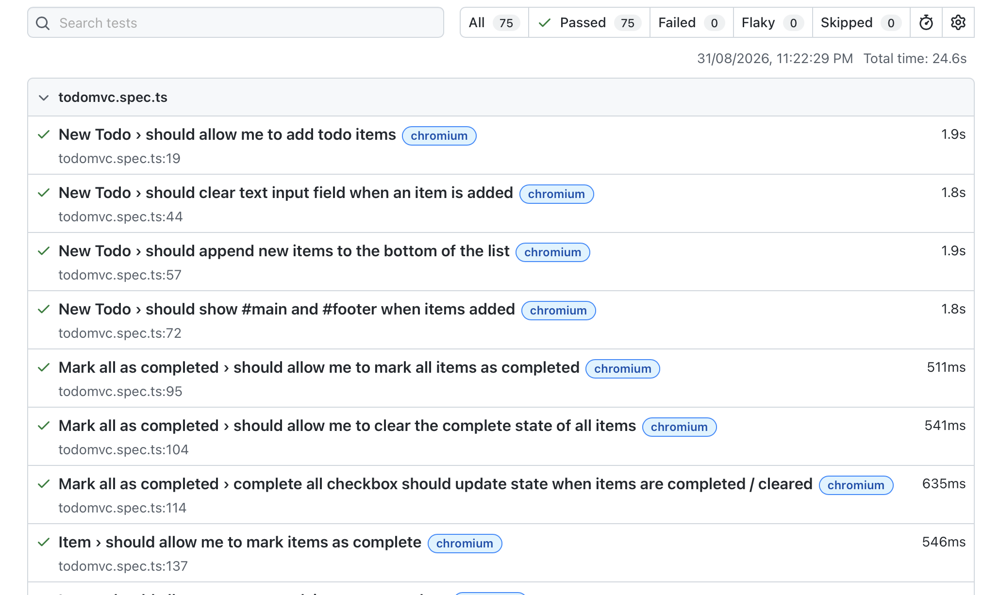

# cd "../Module 9/lab4/lab4"
# npm install
# npx playwright install   
#

# Activity 1
# npx playwright test
## npx playwright test --ui         (for testing in UI mode)

# activity 2
## npx playwright show-report will show report in browser\

Tasks
Complete the following exercises inside the todomvc.spec.ts file.

Task 1: Duplicate Todo Item Validation
Write a Playwright test case to validate that:

Two todo items with the same name can be added successfully
Both items appear in the todo list
Expected Outcome
The application should allow duplicate todo entries and display both items correctly.

Task 2: Empty Todo Validation
Write a Playwright test case to validate that:

An empty todo item should not be added to the list
Expected Outcome
The application should prevent blank todo entries from being created.

# add code then run npx playwright test  OR npx playwright show-report again