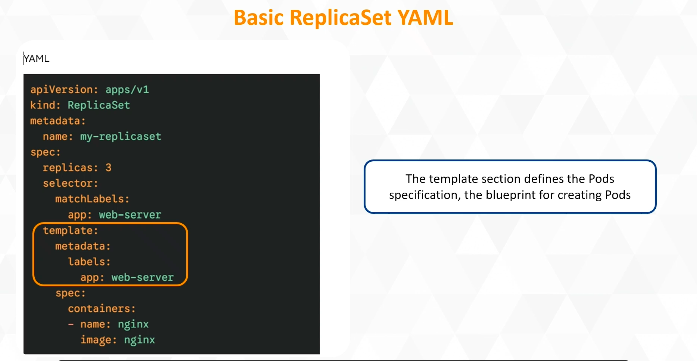
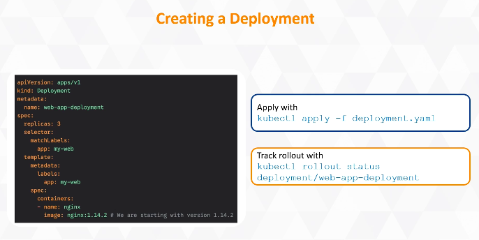
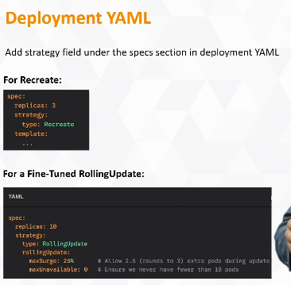

# KUBERNETES

V2 Kubernetes Architecture: The Control Plane​

The Control Plane
Acts as the brain of the cluster
Manages state and makes scheduling decisions
Responds continuously to system events
Keeps all environments in sync

kube-apiserver: The Gateway
Serves as the entry point to the cluster
Receives all user and system requests
Communicates directly with the cluster database
Validates access and permissions
updates the cluster's state as well

etcd: The Memory of Kubernetes
Serves as a consistent, highly available key-value store and single source of truth
Holds all cluster state, configurations, secrets and container statuses—making it the most sensitive component
Survives failures through replication, hence multiple copies are run in production

kube-scheduler: The Matchmaker
Evaluates requests against available worker nodes
Assesses resource availability, such as CPU, RAM and user-defined constraints, for optimal fit
Binds the pod to the best-fit node, then informs the API server to place it

kube-controller-manager: The Enforcer
Runs multiple controller processes in the background
Monitors cluster state to match desired configuration
Detects offline nodes and missing replicas
Initiates fixes when discrepancies occur
Drives the reconciliation loop to maintain desired state

V3 Kubernetes Architecture: The Worker Nodes​

Worker Nodes
Run applications on physical or virtual machines.
Perform the heavy lifting while ensuring the applications remain accessible.

The Kubelet
Communicates with the control plane and receives pod specifications.
Ensures containers are started and remain healthy through constant checks.
Restarts crashed containers to maintain node stability.
Focuses only on the local machine/node, not the entire cluster.
Reports node status back to the control plane, such as:
Memory limits
Workload readiness

Container Runtime
Pulls container images from registries.
Prepares isolated runtime environments.
Starts and manages container processes.
Follows the Container Runtime Interface (CRI).
Powers containers on behalf of the Kubelet.

kube-proxy
Maintains network rules on the host and performs connection forwarding.
Ensures traffic is routed to the correct container, regardless of which node it is on.
Keeps services reachable even when pods move and their IP addresses change.

The Pods: Where Work Happens
Contain the application code.
Represent the smallest deployable unit in Kubernetes.
Are managed by the Kubelet.
Are powered by the Container Runtime.
Are connected through kube-proxy.
Can scale consistently across clusters of different sizes.

v4 pods, label namespaces
Pods
Represent the smallest unit in Kubernetes, acting as a wrapper for containers.
Can host one or more closely related containers that share local network and storage.
Allow containers to communicate through localhost and share files easily.

Labels
Help identify objects, such as Pods.
Group Pods dynamically using selectors.
Find Pods without needing their names or IP addresses.
Allow Kubernetes to remain flexible as Pods change or restart.

Namespaces
Partition clusters into multiple virtual environments for team separation, such as dev vs. prod.
Isolate resources so names only need to be unique within a namespace, avoiding conflicts across environments.

v5 Pods, Labels and Namespaces – Deep Dive

Pods and Sidecar Pattern
Running multiple containers in one Pod is called the sidecar pattern.
Containers in a Pod share a network namespace and communicate with each other through localhost.

Demonstrating Pods in Action
kubectl run my-Pod --image=nginx
Creates a single-container Pod.
kubectl describe Pod my-Pod
Shows the Pod's status, IP address, and lifecycle events in the container section.

Labels and Selectors in Kubernetes
Enable loose coupling.
Tag running Pods:
kubectl label Pods my-Pod env=prod
Filter Pods using selectors:
kubectl get Pods -l env=prod
Match and route traffic to the correct Pods.
Help find Pods without needing their IP addresses.

Namespaces
kubectl get namespaces
Lists all available namespaces in the cluster.
kubectl create namespace development
Creates a new namespace for the development team.
Pods in different namespaces are isolated, allowing identical services to coexist without conflicts.

Declarative Configuration with YAML
The metadata section defines the:
Name
Namespace
Labels
The spec section defines the containers.
Apply the YAML configuration using:
kubectl apply -f Pod-definition.yaml
This enforces the desired state declaratively.

**V6 Maintaining State with ReplicaSets​**

**ReplicaSet**
Acts when the desired state is defined.
Continuously monitors the current state.
Automatically detects mismatches between the desired and current state.
Replaces failed Pods automatically to maintain the desired number of replicas.

## ReplicaSet: Self-Healing

1. **Create the ReplicaSet** using `kubectl apply -f rs-definition.yaml`.
2. **List Pods** with `kubectl get Pods` to confirm three running instances.
3. **Simulate failure** by deleting a Pod using `kubectl delete Pods <Pod-name>`.
4. **Observe recovery** as `kubectl get Pods` shows a new Pod in pending or creating state, restoring the desired count.

## ReplicaSets: Scaling

- **Command Line:** Scale replicas instantly using `kubectl scale rs my-replicaset --replicas=6`. Verify the Pods by running `kubectl get Pods`.
- **YAML:** Update the number of replicas declaratively in the YAML file and apply it using `kubectl apply -f rs-definition.yaml`.

next step is deployment

**v7 Deployments: Mastering Updates​**

## Deployments: Managing App Versions

- Performs **rolling updates** to transition smoothly between versions.
- Creates a **new ReplicaSet**, starts Pods, and validates health before removing old ones.
- **Stops the rollout if issues arise**, ensuring users still have a working version.

## Updating a Deployment
- **Update the YAML file** with `kubectl set image deployment/web-app-deployment nginx=nginx:1.16.1`.
- **Create new Pods while terminating old ones simultaneously** and check them with `kubectl get pods`.
- **Check the ReplicaSets** with `kubectl get rs`.

## Rolling Back a Deployment
- **Check rollout history** using `kubectl rollout history deployment/web-app-deployment`.
- **Undo the rollout instantly** with `kubectl rollout undo deployment/web-app-deployment`.
- Reverses the **rolling update safely** and restores a stable version in seconds.
- Allows shipping code **safely and faster with less risk**.

**v8 rolling update last video.  Deployment Strategies: Recreate vs RollingUpdate**

## Strategy 1: Rolling Update — Default
- **Approach:** Gradually replaces Pods to maintain continuous availability during deployment.
- **Advantage:** Ensures **zero downtime** with uninterrupted user experience.
- **Limitation:** Causes temporary **version overlap**, with users potentially accessing different versions.

## Rolling Update Requirements
- Requires **backward-compatible changes**, as version mismatches can cause crashes.
- Tunes rollout behaviour using **maxSurge** and **maxUnavailable**.

## Strategy 2: Recreate — Clean State
- **Approach:** Terminates all existing Pods first, then starts new ones once the cluster is empty.
- **Advantage:** Ensures a **clean state with no version overlap**, vital for sensitive or legacy systems.
- **Limitation:** Accepts **downtime** as the app is unavailable during the transition.

## Applying Recreate Strategy
- **Use the Recreate strategy** with `kubectl apply -f recreate-dep.yaml`.
- **Watch the Pods** and note the difference with `kubectl get Pods -w`.
- All Pods **terminate together**, and only after they are gone do the new Pods enter the **Pending** state.

## Choosing a Strategy
- Use **RollingUpdate** for most web services to maximise **uptime and user satisfaction**.
- Use **Recreate** only when two versions **cannot share the same database** or for **major breaking changes**.

WORKING WITH YAML FILE GUIDE 
Go to dockerdocs (get started)
part 1 and follow the rest
