#m10.1 selfstudy assignment Organising Kubernetes Resources with Namespaces, Labels and Selectors
steps

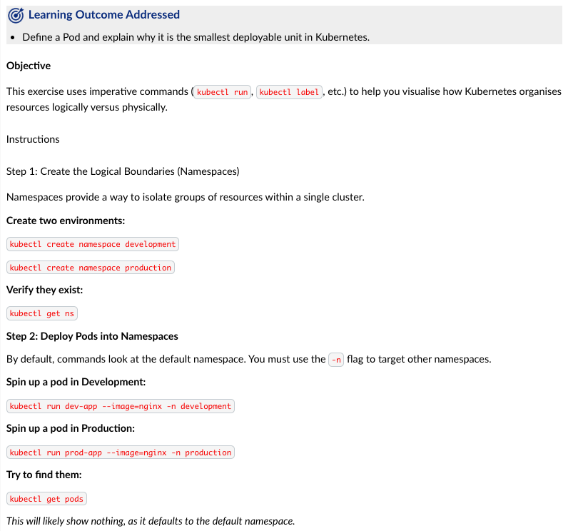
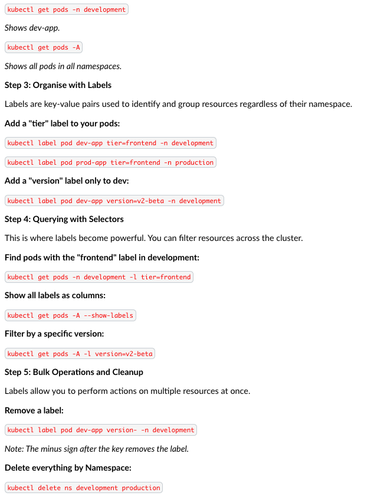
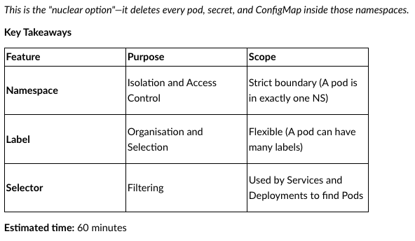

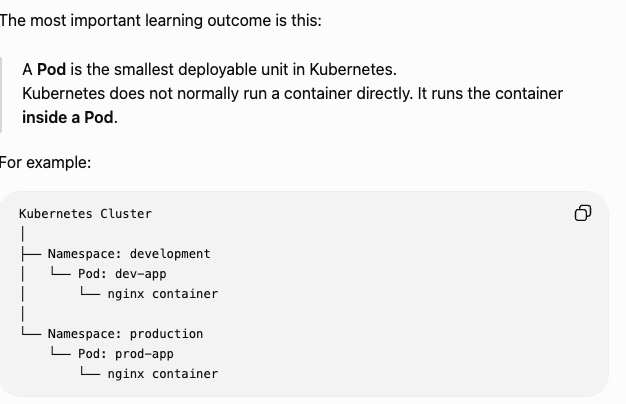
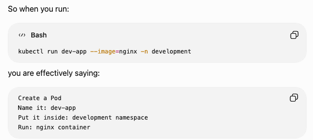

**STEP1**
creation
kubectl create namespace development
kubectl create namespace production

verify
kubectl get ns 

should see something like this
NAME              STATUS   AGE
default           Active   ...
development       Active   ...
kube-node-lease   Active   ...
kube-public       Active   ...
kube-system       Active   ...
production        Active   ...

The important part is seeing: development and production
A namespace is basically a logical folder/boundary inside Kubernetes.
Cluster
├── development
└── production
take a screenshot of kubectl get ns if your assignment requires evidence.
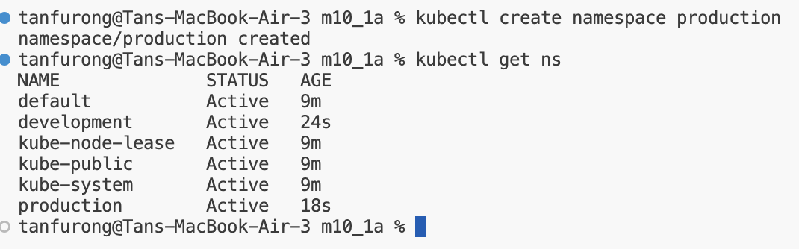

**STEP2**
kubectl run dev-app --image=nginx -n development
kubectl run prod-app --image=nginx -n production
Run:
kubectl get pods
You may see:
No resources found in default namespace.

kubectl get pods -n development
EXPECTED:
NAME      READY   STATUS    RESTARTS   AGE
dev-app   1/1     Running   0          ...

check production:
kubectl get pods -n production

see everything: (-A means All namespaces)
kubectl get pods -A

so rmbL
**kubectl get pods** means: Show Pods in default namespace
**kubectl get pods -n development** means: show pods inside development
**kubectl get pods -A** means show pods everywhere

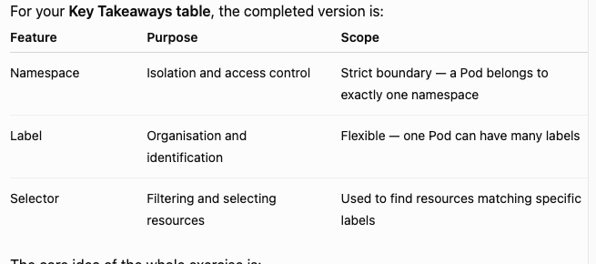

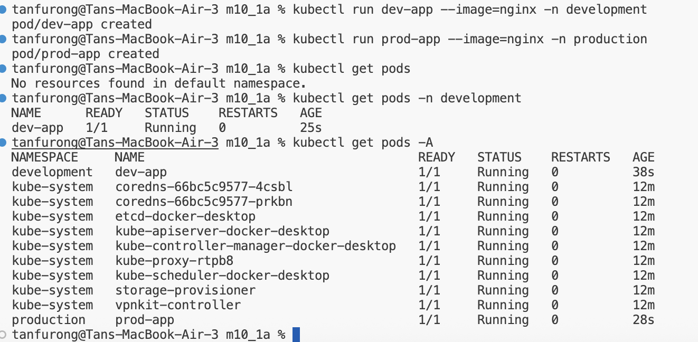

Namespace = WHERE the Pod belongs
Label     = WHAT the Pod is
Selector  = HOW you find it

for example:
development        ← namespace
    dev-app         ← pod
    tier=frontend   ← label
    version=v2-beta ← label

**STEP3**
kubectl label pod dev-app tier=frontend -n development
kubectl label pod prod-app tier=frontend -n production
kubectl label pod dev-app version=v2-beta -n development

check labels:
kubectl get pods -A --show-labels
should see sth like this:
NAMESPACE     NAME       READY   STATUS    LABELS
development   dev-app    1/1     Running   tier=frontend,version=v2-beta
production    prod-app   1/1     Running   tier=frontend
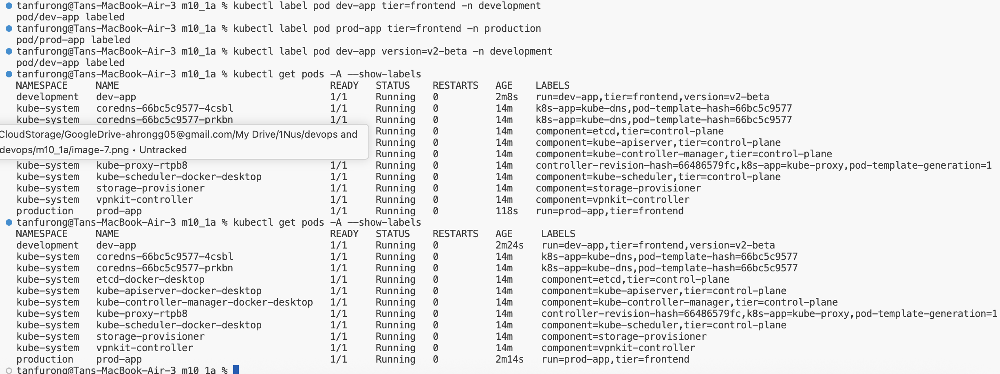

**STEP4**
kubectl get pods -n development -l tier=frontend

**-l tier=frontend** means show only pods whose label is tier=frontend
**kubectl get pods -A --show-labels**
**kubectl get pods -A -l version=v2-beta**

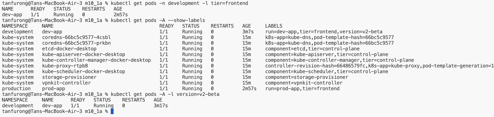

**STEP5**
kubectl label pod dev-app version- -n development
notice **version-** The - means remove that label.

check again:
kubectl get pods -A --show-labels

clean everything up:
kubectl delete ns development production

run:
kubectl get ns
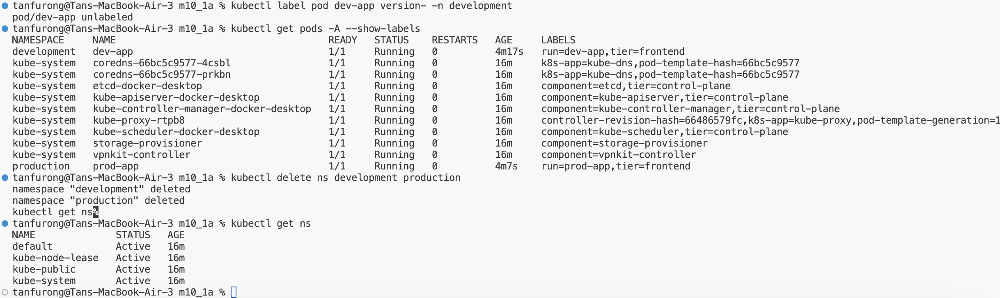

**FLOW**
Create namespace
      ↓
Create Pod
      ↓
Add labels
      ↓
Use selectors to find Pods
      ↓
Remove label
      ↓
Delete namespaces

kubectl get ns showing development and production
kubectl get pods -A showing both Pods
kubectl get pods -A --show-labels showing your labels
kubectl get pods -A -l version=v2-beta showing only dev-app