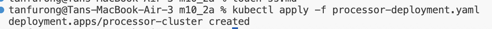
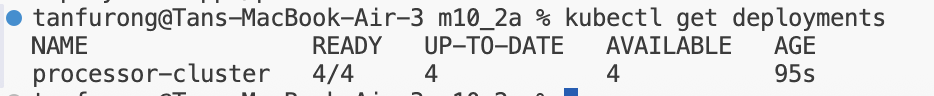
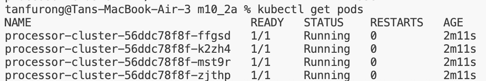
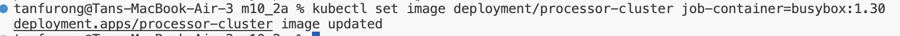
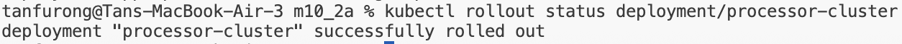

**Create yaml file and input content:**

then run command:
**kubectl apply -f processor-deployment.yaml**
means 
to read that YAML file and create or update the resources described inside it.

Breakdown:
kubectl        # command-line tool for Kubernetes
apply          # create/update the resource to match the YAML
-f             # use a file
processor-deployment.yaml   # the YAML file to read

**Check that the Deployment and 4 pods were created:**

**Then update the image from busybox:1.28 to busybox:1.30:**
kubectl set image deployment/processor-cluster job-container=busybox:1.30

**Then monitor the rolling update:**
kubectl rollout status deployment/processor-cluster

**verify new image**
kubectl get deployment processor-cluster -o wide
OR
kubectl describe deployment processor-cluster

**Deployment → ReplicaSet → Pods**

