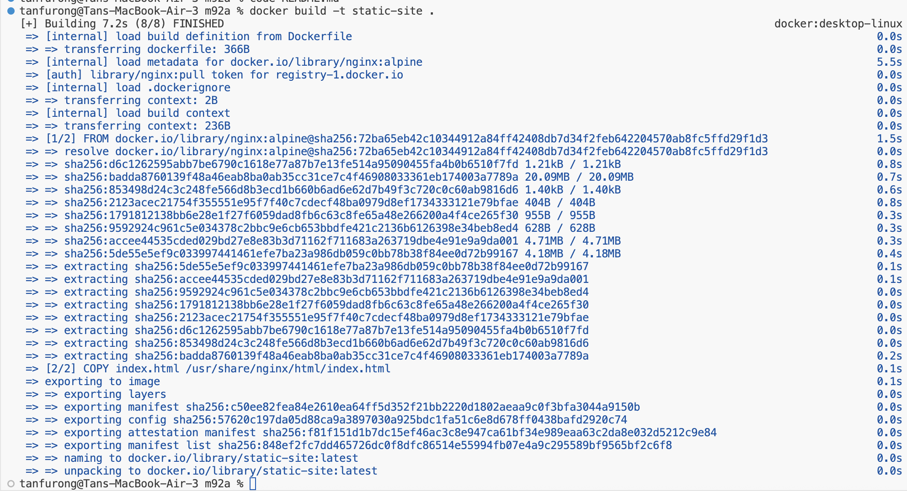
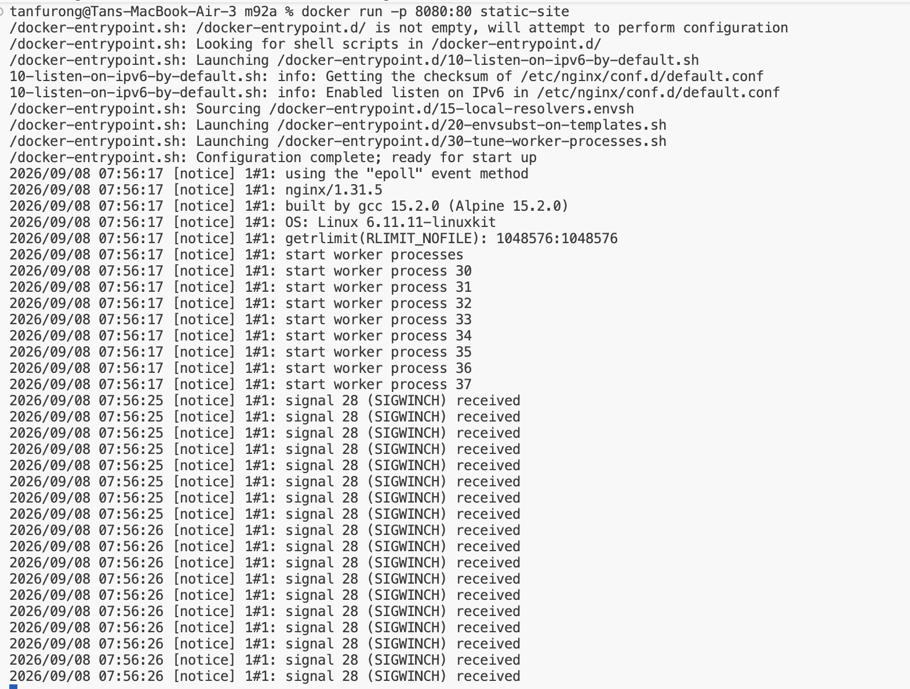
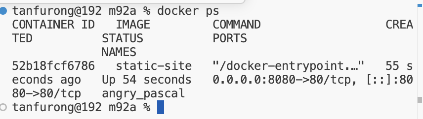
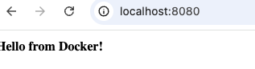
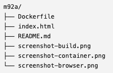

MAKE FOLDER 
make 3 files : index.html , Dockerfile, README.md
put content inside index.html

CREATE DOCKER FILE AND ITS CONTENT:
FROM nginx:alpine
COPY index.html /usr/share/nginx/html/index.html
EXPOSE 80

BUILD DOCKER IMAGE INSIDE THE CREATED FOLDER 
docker build -t static-site .
screenshot successfully build .....

CHECK IF DOCKER IMAGE EXIST -docker images

RUN THE CONTAINER
docker run -p 8080:80 static-site

