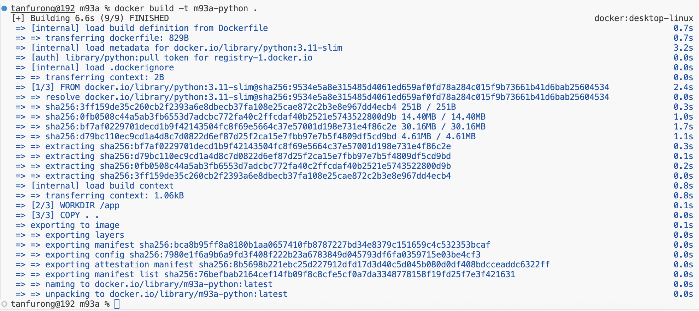
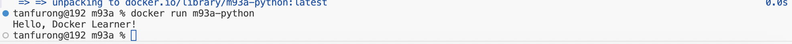

CREATE PYTHON FILE
CREATE DOCKERFILE...

AFTER SETTING UP
make sure inside selected folder. check path use pwd

DOCKER BUILD (build docker image)
then run commnad:
docker build -t m93a-python
#docker build -t (can change this var name)
Screenshot of docker build

DOCKER RUN
then run command:
docker run m93a-python

